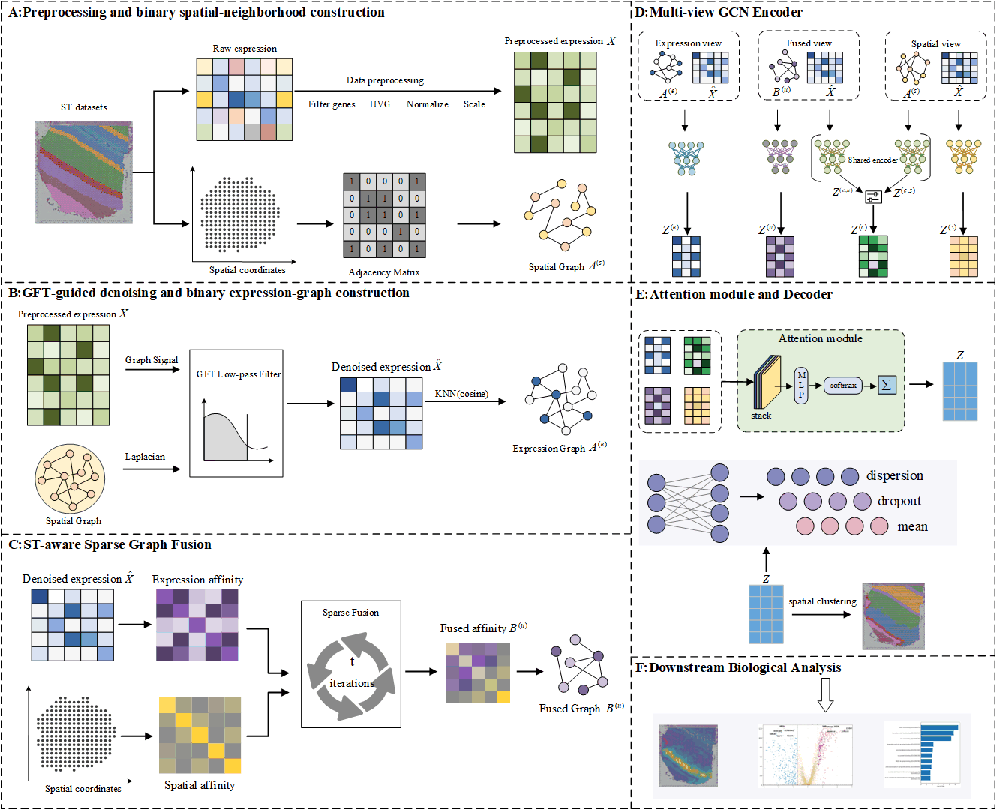

# MSFG

MSFG is a reproducible implementation for spatial domain identification using graph Fourier filtering, similarity network fusion, multi-view graph convolution, attention-based view integration, and ZINB reconstruction.



## Reproducibility guarantee

The mathematical implementation in `models.py`, `layers.py`, and `utils.py` is preserved from the validated research code. The YAML/CLI layer only selects a dataset and passes parameters to the established dataset runner; it does not implement a second training path.

## Installation

```bash
git clone <repository-url>
cd MSFG
pip install -r requirements.txt
```

The code was validated with Python 3.10.18, PyTorch 2.4.1 (CUDA 12.1 build), Scanpy 1.11.4, NumPy 1.26.4, and scikit-learn 1.7.2. See `environment.yml` for the complete tested environment. A compatible CUDA-enabled PyTorch installation should be selected for the local driver; CPU execution is also supported.

Run every command from the repository root so relative data and result paths resolve consistently.

## Reproduce manuscript experiments

```bash
python train.py --config configs/paper/dlpfc_151507.yaml
python train.py --config configs/paper/mouse_e1s1.yaml
python train.py --config configs/paper/mba.yaml
python train.py --config configs/paper/hbrc.yaml
```

The `configs/paper/` directory provides example configurations for the four datasets evaluated in the manuscript: DLPFC, mouse E1S1, MBA, and HBRC. Each YAML file records a representative parameter configuration for running the corresponding dataset. To run a new experiment, copy and modify an existing YAML file while keeping the manuscript configurations unchanged.

## Optional parameter sweeps

CSV is retained only as an optional experiment-sweep interface:

```bash
python scripts/run_sweep.py --base-config configs/paper/dlpfc_151507.yaml --csv my_sweep.csv
```

The CSV may contain any subset of the exposed parameters. YAML remains the primary documented interface.

## Notebook

`notebooks/quick_start.ipynb` demonstrates configuration loading and calls the same `train.run_from_config()` API used by the command line. No model or loss implementation is duplicated in the notebook.

## Core files

- `models.py`: multi-view GCN, shared gate, attention fusion, and ZINB decoder.
- `layers.py`: graph convolution layer.
- `utils.py`: preprocessing, graph construction, SNF, losses, training, and output utilities.
- `run_*.py`: dataset-specific loading and label alignment.
- `train.py`: unified YAML command-line entry point.

## Repository layout

```text
MSFG/
├── assets/             # Model architecture and README figures
├── configs/            # Reproducible YAML experiment configurations
├── data/               # Local datasets (excluded from Git)
├── notebooks/          # Quick-start tutorial using the production API
├── scripts/            # Optional parameter-sweep utilities
├── train.py            # Primary command-line entry point
├── models.py           # MSFG network
├── layers.py           # Graph convolution layer
└── utils.py            # Graph construction, losses, and training
```

## Reproducibility notes

- Run commands from the repository root; dataset and result paths are relative to it.
- Record the YAML file, random seed, package environment, and dataset version for every reported result.
- The training loop selects the best checkpoint by ARI at the configured evaluation interval. This matches the validated experimental code and uses ground-truth labels during model selection.
- Large datasets, generated results, and reconstructed `.h5ad` files are intentionally excluded from version control.

